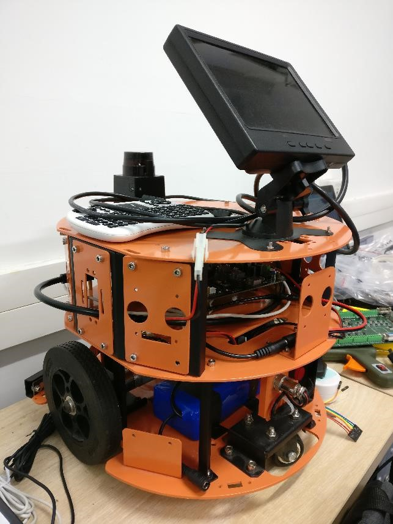
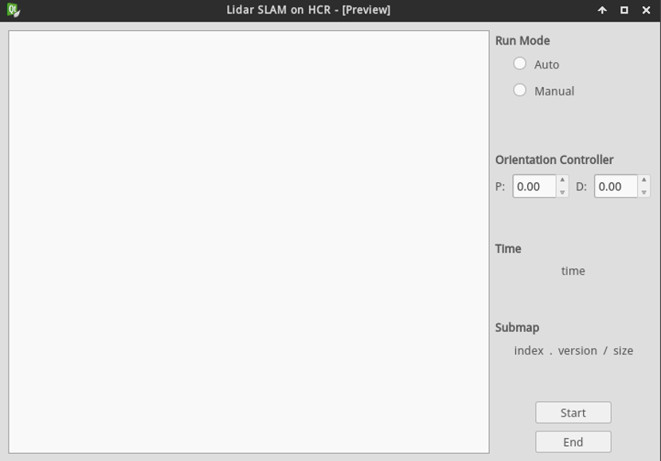
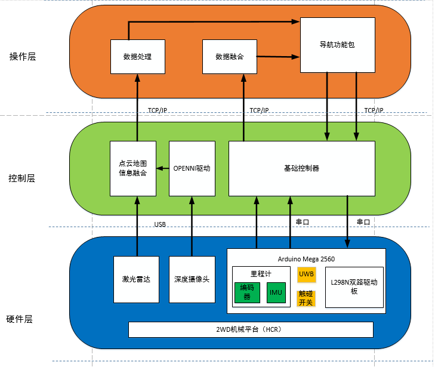
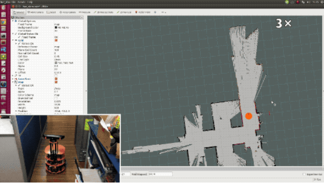
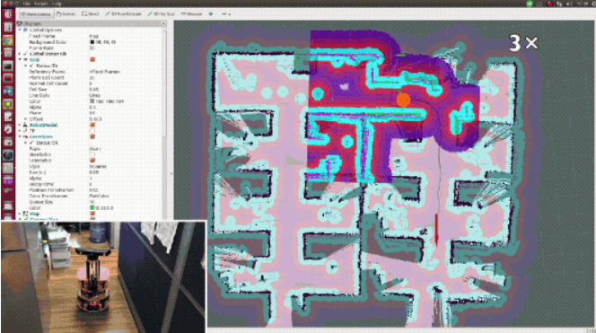
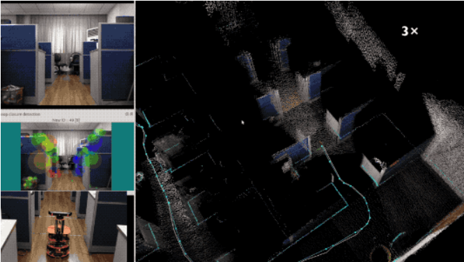
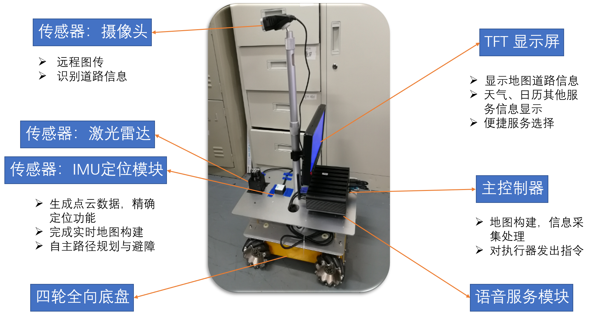
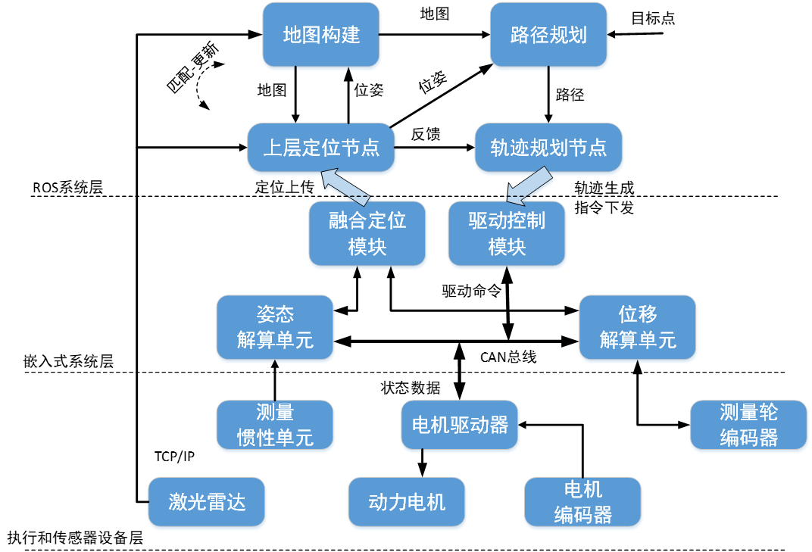
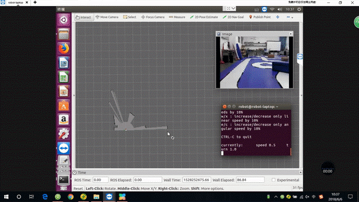
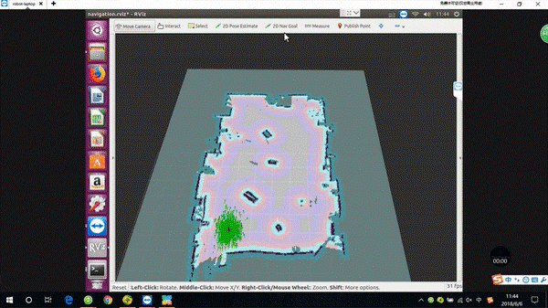

# 2WD_Robot ROS Package

The repository contains ROS packages for Robot.

## 一、两轮差动机器人

### QT控制界面

### 层级架构

### 运行结果 Demo

#### SLAM Demo

#### Robot Navigation Demo

#### Robot 3D SLAM Demo

## 二、麦克纳姆轮机器人

### 层次架构

### 运行结果

#### SLAM建图

#### SLAM导航

